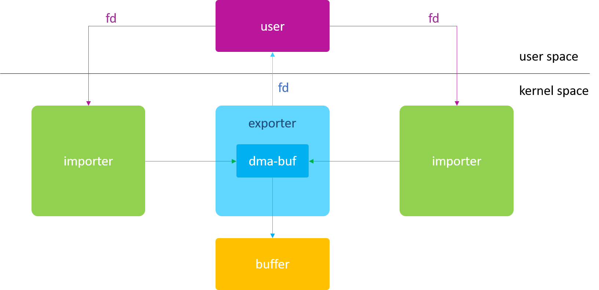
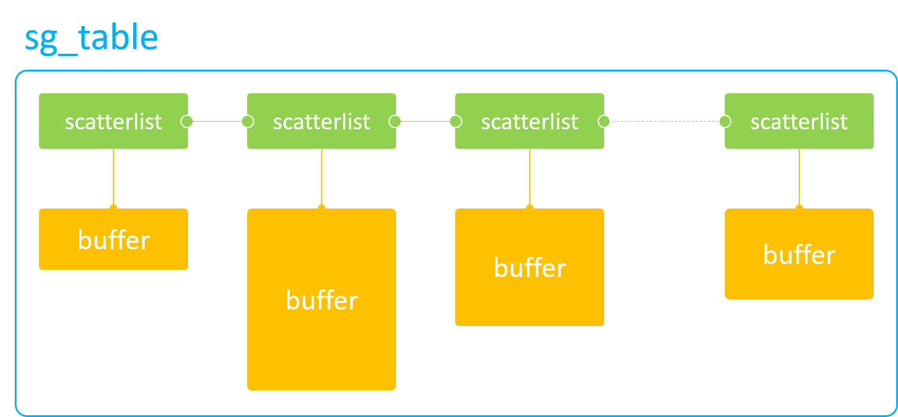
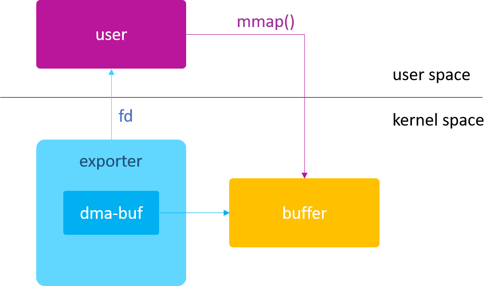

# dma-buf driver
Linux dma-buf driver.
Implementation of dma-buf exporter and importer drivers in WSL-6.1.y environment

[Reference](https://blog.csdn.net/hexiaolong2009/article/details/102596744)


# dma-buf
dma-buf: 버퍼 + 파일, 다양한 드라이버 간의 버퍼 공유 문제를 해결하기 위해 존재. physical block buffer 이자 Linux File 이다. Buffer는 contents이고 file은 매체이며, file 매체를 통해서만 다른 드라이버 간에 동일한 buffer를 전송할 수 있다.


# Exporter and Importer



 * exporter: producer, 버퍼를 할당하는 모듈
 * importer: consumer, 버퍼를 사용하는 모듈


# CPU (Kernel) Access
dma_buf_vmap(): 메모리를 커널 공간에 매핑하고 CPU가 지속적으로 액세스 할 수 있는 가상 주소로 변환하여 커널에서 이 메모리를 직접 읽고 쓸 수 있도록 한다. 따라서 *버퍼가 물리적으로 연속적인지 여부에 관계없이 가상 주소는 vmap 매핑 이후에 연속적이어야 한다.*


# Hardware Access
## DMA Access
DMA 하드웨어 액세스를 위한 두 가지 중요 API
 * dma_buf_attach()
 * dma_buf_map_attachment()


### sg_table


sg_table: 물리적으로 연속된 단일 버퍼를 모아 만든 불연속 버퍼
 * sg_dma_address(SGL)
 * sg_dma_len(SGL)

DMA 하드웨어가 이 작은 버퍼 조각들에 액세스 할 수 있도록 버퍼의 물리주소와 길이를 DMA 하드웨어 레지스터에 저장할 수 있다.
전체 버퍼 테이블을 액세스 하려면 for 루프를 사용하여 sg를 지속적으로 파싱하고 DMA 하드웨어 레지스터를 지속적으로 구성하면 된다.
```
IOMMU
IOMMU는 프로그래머가 루프를 작성하는 번거로움을 해결한다.
for 루프에서 DMA 하드웨어 레지스터를 구성할 때마다, DMA 전송이 완료될 때까지 다음 sg는 작업을 기다려야하기 떄문에 소프트웨어의 효율성이 크게 떨어진다.
IOMMU의 기능은 sg_table을 파싱하는 것이다.
sg_table 내부의 작은 개별 버퍼를 IOMMU 자체 내부 장치 주소 공간에 매핑하여 전체 버퍼가 이 장치 주소 공간에서 연속되도록 한다.
이러한 방식으로 불연속 버퍼에 액세스할 때 IOMMU 매핑된 디바이스 주소(MMU에 의해 매핑된 CPU 가상 주소가 아니다)와 전체 버퍼의 크기를 DMA 하드웨어 레지스터에 구성하기만 하면 여러번 DMA 레지스터 구성을 할 필요가 없다.
```


dma_buf_attach():
"dma-buf attach device"의 약자. dma-buf와 device 간의 연결을 설정하는 데 사용.
이러한 연결은 새로 생성된 dma_buf_attachment 객체에 저장됨.


dma_buf_map_attachment():
"dma-buf map attachment into sg_table"의 약자. 두 가지 주요 작업을 수행한다.
  1. sg_table 생성
  2. 캐시 동기화

물리 주소 대신 sg_table을 반환하는 것은 sg_table이 연속 및 비연속 물리 메로리를 모두 나타낼 수 있기에 모든 DMA 하드웨어와 호환되기 때문이다.

캐시를 동기화하는 목적은 버퍼가 CPU에 의해 미리 채워지는 것을 방지하는 것이다.
데이터는 DDR 대신 캐시에 임시로 저장되므로 DMA가 유효한 최신 데이터에 액세스하지 않는다.
이는 캐시 데이터를 DDR에 다시 기록하여 방지할 수 있다.
마찬가지로 DMA가 메모리에 액세스한 후 종료된 후에는 CPU가 캐시 대신 DDR에서 직접 데이터를 읽을 수 이도록 캐시를 invalidation 해야 한다.
일반적으로 다음과 같은 스트리밍 DMA 매핑 인터페이스를 사용하여 캐시 동기화를 한다.
* dma_map_single()/dma_unmap_single()
* dma_map_page()/dma_unmap_page()
* dma_map_sg()/dma_unmap_sg()

### Attachment 가 필요한 이유
여러 DMA 하드웨어에서 동일한 dma-buf에 액세스 할 수 있으며, 각 DMA 하드웨어는 자체 하드웨어 기능으로 인해 이 버퍼에 대한 고유한 요구사항을 가질 수 있다.
예를 들어, 하드웨어 A의 어드레스 범위는 0x0 ~ 0x1_0000_0000 이고, 하드웨어 B의 어드레스 범위는 0x0 ~ 0x8_0000_0000 인 경우,
dma-buf의 물리 메모리를 할당할 때 하드웨어 A의 범위에 맞춰 할당해야 하드웨어 A와 B 모두 이 메모리에 액세스 할 수 있다.
Attachment를 통해 exporter 드라이버는 서로 다른 장치의 하드웨어 기능에 따라 가장 적절한 물리 메모리를 할당할 수 있다.
```
device->dma_params 매개 변수를 설정하여 DMA 하드웨어의 어드레스 제한을 exporter 에게 알릴 수 있다.
```

### 메모리는 언제 할당되는가?
답은 DMA 하드웨어 기능에 따라 dma_buf_export 단계, map attachment 단계에서 둘 다 할당할 수 있다는 것이다.

우선 드라이버는 현재 시스템의 어떤 DMA 하드웨어가 dma-buf에 액세스하려 하는지 계산해야 한다.
그런 다음 DMA 하드웨어 기능에 따라 실제 메모리를 할당하는 시기와 방법을 결정한다.

일반적인 전략은 다음과 같다. (A와 B 두 하드웨어만 dma-buf에 액세스한다고 가정)

  * 하드웨어 A와 B의 메모리 주소 사이에 교집합이 있는 경우: 메모리 할당은 dma_buf_export 단계에서 수행되며 A와 B의 교집합이 우선된다.
  * 하드웨어 A와 B의 메모리 주소 사이에 교집합이 없는 경우: 메모리 할당은 map attachment 단계에서만 수행될 수 있다.

두 번째 전략의 경우, A와 B의 메모리 주소가 겹치지 않기 때문에 (즉, 완전히 독립적이기 때문에) 실제로 메모리 공유가 아니다.
이 경우의 해결책은 A와 B가 map attachment 단계에서 자신의 물리 메모리를 할당한 다음 CPU 또는 범용 DMA 하드웨어를 통해 A의 버퍼 내용을 B의 버퍼에 복사하여 버퍼 "공유"를 간접적으로 실행하는 것이다.

또한 먼저 dma_buf_export 단계에서 메모리를 할당한 다음, 첫 번째 map attachment 단계에서 모든 장치의 기능을 dma_buf->attachments 연결 목록과 비교하고
조건이 충족되면 sg_table을 반환하는 또 다른 전략이 있다. 조건이 충족되지 않으면 모든 장치 요구 사항을 충족하는 실제 메모리가 다시 할당되고 새 sg_table로 반환된다.

# mmap
dma_buf_ops에서 제공하는 mmap 콜백 인터페이스 외에도 dma-buf는 다른 device driver에서 dma-buf의 mmap 구현을 직접 참조할 수 있도록 하는 커널 API를 제공한다. 이 API를 통해 device 기반 mmap 파일 작업 인터페이스를 간접적으로 구현할 수 있다.




User space에서 dma-buf의 physical memory에 액세스 할 수 있는 두 가지 방법을 보여주는 예제를 살펴보자.

 * 예제 1: DMA-BUF의 fd를 사용하여 mmap() 작업 수행
 * 예제 2: exporter driver의 fd를 사용하여 mmap() 조작 수행

## 예제 1
dmabuf_exported의 fd를 user에게 전달하고, user가 직접 dmabuf_exported를 다룰 수 있도록 한다.
유저가 dmabuf_exported의 fd로 mmap()을 수행하면, dmabuf_exported의 dma_buf_ops인 exporter_mmap()이 call된다.

## 에제 2
dma-buf API인 `dma_buf_mmap()`을 사용하여 character device (exporter)의 mmap() file_operations 요청을 대응한다.